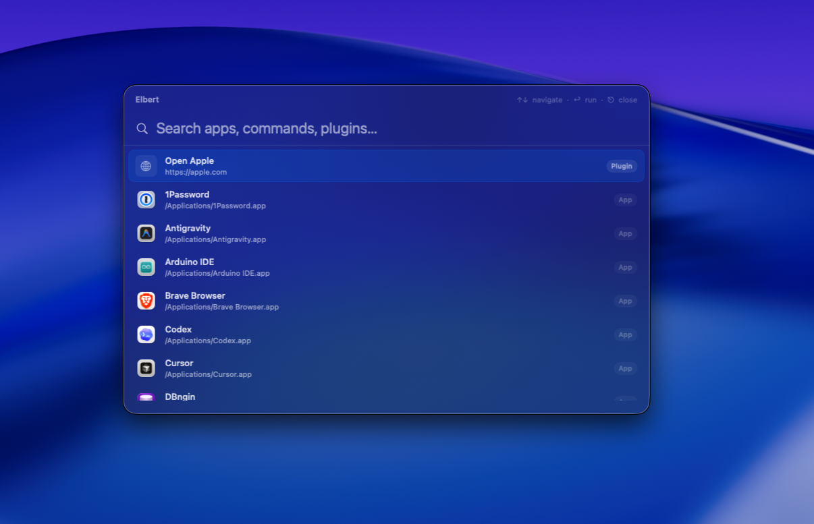

# Elbert

Elbert is a fast macOS launcher built with SwiftUI. It helps you find and open apps, search indexed files, and stay in flow with a global shortcut.

## Preview

## Why Elbert

- Fast, keyboard-first launcher experience
- Native SwiftUI macOS app
- Configurable folder indexing for file search
- Fuzzy search with typo tolerance

## Current Features

- **Global shortcut launcher**: Open Elbert from anywhere (default: `Cmd + Shift + Space`).
- **Application indexing**: Indexes apps from `/Applications` and `~/Applications`.
- **File indexing**: Index selected folders and search files by name, extension, and path tokens.
- **Fuzzy search ranking**: Prefix, contains, subsequence, and typo-tolerant matching.
- **Onboarding and settings**: First-run onboarding, hotkey recorder, indexed folder management, index rebuild.
- **Extensions SDK (launcher modules)**: Install custom Swift extensions and let users enable/disable each module.

## Upcoming Features

These are planned features for future releases:

1. **Clipboard history with CloudKit sync**
   - Local clipboard timeline.
   - Optional CloudKit sync across your Apple devices.

2. **Currency conversion**
   - Quick currency conversions from natural input.
   - Cached rates with background refresh.

## Development

### Requirements

- macOS (latest stable recommended)
- Xcode (latest stable recommended)

### Run locally

1. Clone the repository.
2. Open `Elbert.xcodeproj` in Xcode.
3. Select the `Elbert` target/scheme.
4. Build and run.

### Architecture (high level)

- `AppCoordinator`: App state and orchestration.
- `SearchIndex`: Application and indexed file search + ranking.
- `ActionExecutor`: Executes selected actions (app, URL, shell).
- `Features/*`: UI for launcher, onboarding, settings, and menu bar.

## Open Source

Contributions are welcome. To get started, read:

- `CONTRIBUTING.md`
- `EXTENSIONS.md`
- `CODE_OF_CONDUCT.md`
- `SECURITY.md`
- `ROADMAP.md`

## License

This project is licensed under the `MIT License` (see `LICENSE`).
